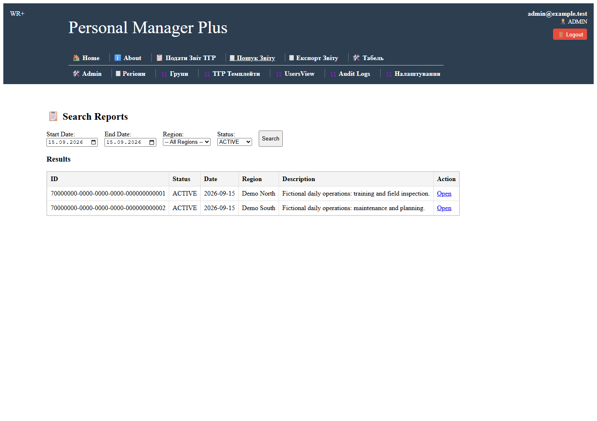
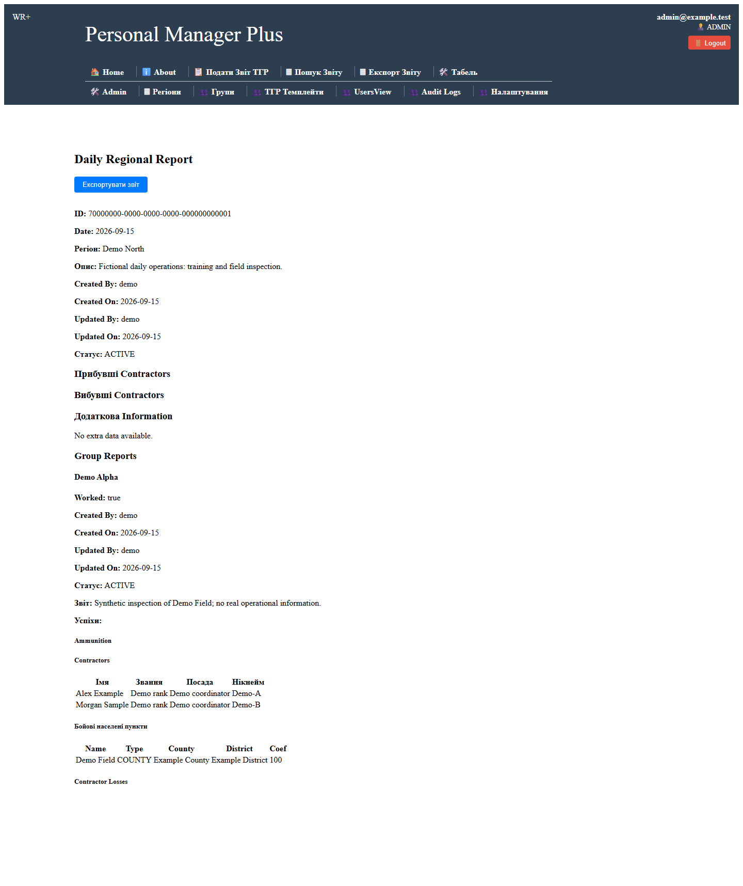
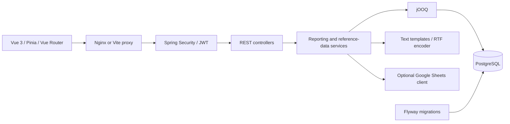

# WorkReportPlus

A Java and Vue application for collecting regional and team reports, maintaining personnel records, and exporting daily or monthly summaries.

The project grew around a workflow where reference data and operational updates arrived through spreadsheets. It brings reporting, personnel assignments, report history, and document generation into one application. This public edition uses **fictional people, teams, places, and operational descriptions**. No Google account is needed for the demo.

## Screenshots

Screenshots below come from the running application with synthetic fixtures.





## Features

- Regional reports containing team reports and personnel assignments.
- Search by date, region, and active or historical status.
- Atomic report replacement: the new parent and children commit together; earlier versions remain in history.
- Role-based access, password hashing, bearer-token authentication, and audit events.
- Regional and team management, editable report templates, daily and monthly RTF export.
- Optional read-only Google Sheets integration for existing spreadsheet workflows.

The reporting interface retains some Ukrainian labels. Setup and architectural documentation are in English.

## Run the local demo

**Prerequisites:** JDK 21 and Docker Engine/Desktop running Linux containers, with Docker Compose v2. Node.js 22 is needed only for frontend development and browser tests; the frontend Docker build supplies Node itself. Initial builds download dependencies and container images.

From the repository root, on Linux/macOS:

```sh
bash gradlew clean build --console=plain
docker compose up --build --wait
```

On Windows PowerShell:

```powershell
.\gradlew.bat clean build --console=plain
docker compose up --build --wait
```

Open **http://localhost:5178** and sign in:

| Field | Local demo value |
| --- | --- |
| Email | `admin@example.test` |
| Password | `demo-admin-password` |

The demo includes Demo North, Demo South, two teams, three fictional people, and reports dated on the database's first initialization day. Search the initialization date if you return later. Demo fixtures use stable IDs and do not overwrite edits on restart.

Try **Search Reports → Open → Export**, then submit a report for Demo North. The previous version becomes historical. Without Google, demo personnel appear in the available/resting group for manual reporting; external attendance and operational feeds are empty.

Compose binds the web UI and PostgreSQL to loopback only. The backend is reachable through the web UI's `/api` proxy inside Docker; it has no published host port. This Compose file is deliberately a local demo configuration, with public demo passwords.

Stop the demo while keeping its data:

```sh
docker compose down
```

To erase **only this demo's data** and start again, use `docker compose down --volumes` before restarting it.

### What the build does

1. Starts a disposable PostgreSQL 16.6 container.
2. Applies the Flyway migrations and generates jOOQ Java classes from that schema.
3. Compiles the application and runs integration tests against another disposable PostgreSQL database.
4. Produces `build/libs/workreportplus.jar`.

The build never connects to your existing application database. Generated jOOQ files are build output. The Gradle wrapper, fixed application version, stable JAR filename, and npm lockfile make fresh-clone builds repeatable. Docker must be available even for the first Java compilation.

## Development

Start just the demo database, then run the backend:

```sh
docker compose up -d db
bash gradlew bootRun
```

Use `.\gradlew.bat bootRun` on Windows. The default Spring profile is `demo`; the Java process listens on port 8080. Use a free port and set `API_PROXY_TARGET` for Vite if another application occupies 8080.

In another terminal:

```sh
cd frontend
npm ci
npm run dev
```

Vite listens on http://localhost:5178 and proxies `/api` to http://localhost:8080. Stop the Compose frontend before using Vite on the same port.

## Architecture



| Area | Choice and reasoning |
| --- | --- |
| Runtime | Java 21, Spring Boot. The public build standardizes the earlier Java 17 project on JDK 21. |
| Persistence | jOOQ keeps SQL and PostgreSQL-specific arrays/JSONB visible and supplies generated types. Flyway defines the schema. |
| Report consistency | One Spring transaction covers the parent, children, and retirement of previous versions. A PostgreSQL row lock serializes submissions for the same region. Different regions can proceed independently. |
| History | Replacement creates a new version and marks prior parent/children inactive. History remains in the database. |
| Authentication | BCrypt passwords and one JWT filter. Each request reloads the current role from the database, so a role change affects already-issued tokens. |
| Demo isolation | Profile-specific SQL fixtures and an optional Google client. The demo uses a fresh signing key on each process start, invalidating older tokens after restart. |
| Integration verification | Real PostgreSQL/Testcontainers exercises migrations, permissions, transactions, concurrency, and exports. Playwright checks the browser workflow. |

### Authorization

| Role | Permissions |
| --- | --- |
| Unauthenticated | Login, registration, health ping. |
| GUEST | Own account information; no report or administration access. New registrations always get this role. |
| USER | Read reports/reference data and export reports. |
| POWER_USER | USER access plus report submission. |
| ADMIN | All application APIs, including users, settings, imports, and audit logs. |

Roles apply across the application; this is not a multi-tenant system and there is no per-region ownership model. Hiding a button in Vue is not the authorization boundary: the backend enforces these rules.

## Configuration outside the demo

See [.env.example](.env.example). Java does **not** automatically load `.env` files: export the variables in your shell, deployment platform, or systemd environment file.

- Set `SPRING_PROFILES_ACTIVE=production` explicitly.
- Configure `DB_URL`, `DB_USER`, and `DB_PASSWORD` for a **new database**.
- Provide a randomly generated `JWT_SECRET` containing at least 32 UTF-8 bytes.
- Optionally supply `ADMIN_EMAIL` and `ADMIN_PASSWORD` to bootstrap an administrator once. The password must be at least 12 characters and at most 72 UTF-8 bytes. Existing users are not reset during startup.
- Set `CORS_ORIGINS` as a comma-separated list when using a separate frontend origin.
- Terminate HTTPS at your deployment proxy. The bundled Compose file is for local use.

Never activate the `demo` profile on a public server. This edition sanitizes a historical migration; it is a fresh-database distribution, **not an in-place migration of an existing private deployment**. Do not use Flyway repair to bypass that distinction.

### Optional Google Sheets

Google access defaults to disabled. To enable it, supply `GOOGLE_ENABLED=true`, a filesystem path in `GOOGLE_CREDENTIALS_FILE`, and the required sheet IDs from `.env.example`. Mount the credential file outside the application/JAR and grant the service account read access only to the required spreadsheets.

Personnel, reference, and the two operational feeds are configured independently. Regional attendance mappings are managed in application settings using the `attendance_map` entry. The parsers retain the original worksheet/range conventions; enabling the integration requires adapting those layouts to your own spreadsheets. No production spreadsheet identifiers are shipped.

## Validation and CI

```sh
bash gradlew test
cd frontend
npm ci
npm run build
npx playwright install chromium
# Start the demo with Docker Compose before this step:
npx playwright test
```

Backend tests cover unauthorized user management, registration escalation, password non-disclosure, role revocation, malformed tokens, reader/writer permissions, report flags, rollback, region isolation, concurrent submissions, Google-disabled behavior, and a readable RTF export.

[CI](.github/workflows/ci.yml) builds both applications, runs the PostgreSQL tests, starts the packaged demo, and checks login → search → report → export in Chromium. It uploads test reports and stops its demo containers afterward.

To regenerate the screenshots against the local demo:

```sh
cd frontend
CAPTURE_SCREENSHOTS=true npx playwright test
```

PowerShell: `$env:CAPTURE_SCREENSHOTS='true'`, then `npx.cmd playwright test`.

## Publication and sensitive history

Read [PUBLICATION.md](docs/PUBLICATION.md) before publishing an existing private checkout. Removing a file from the working tree does not remove it from Git history.

`node scripts/check-public.mjs` performs targeted checks on publishable working-tree files. `node scripts/export-public.mjs` creates a snapshot under `.local/public-release/WorkReportPlus` without the original Git history or ignored local files. It refuses to overwrite an existing snapshot.

## Known limitations

- Some screens and domain names remain specific to the original reporting workflow; full English localization is unfinished.
- Spreadsheet parsers are layout-specific. Google-disabled mode does not simulate external attendance calculations.
- JWTs are stored in browser local storage. There is no refresh-token flow, MFA, password-reset workflow, or built-in login rate limiting.
- Broad report queries can perform repeated lookups and are not comprehensively paginated. Large deployments need query profiling and load testing.
- Export templates are plain text with placeholders, encoded as RTF at download time. Rich-text template editing and PDF/DOCX generation are not provided by this export path.
- Fixtures and automated tests demonstrate behavior; they are not a claim of production hardening or measured business impact.

This repository demonstrates a reporting application and its engineering tradeoffs. No usage figures, performance claims, or customer outcomes are implied.
